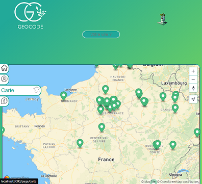

 

# GEOCODE - Find an electric terminal

GEOCODE is a MVP(Minimum Viable Product) website that lists all the electrical terminals in France. Visitors can access the terminals of their choice, by entering a city, approved by the administrator. All the information needed to understand each terminal system is provided.
Eventually, users will be able to reserve a terminal and create their own profile.

There are three levels of authenticated users:

- Visitors > They can find electrical terminals.
- Connected users (term users) > They can reserve a terminal.
- Administrators > They can add and modify terminals.



## Setup & Use

Here is the link to launch the MVP website directly : https://geocode.remote-6.wilders.dev/

### Windows users

Be sure to run these commands in a git terminal to avoid [issues with newline formats](https://en.wikipedia.org/wiki/Newline#Issues_with_different_newline_formats):

```shell
git config --global core.eol lf
git config --global core.autocrlf false
```

### Project Initialization

In VSCode, install plugins **Prettier - Code formatter** and **ESLint** and configure them

Clone this repo, enter it:
```shell
git clone "git@github.com:WildCodeSchool-2023-09/JS-RemoteFR-jurascripts-P3-Geocode.git"
```

Install dependencies:
```shell
npm install
```

- Create environment files (`.env`) in both `backend` and `frontend`: you can copy `.env.sample` files as starters (**don't** delete them) and modify data as required.

Run migrate scripts:
```shell
npm run db:migrate
```

Then move to the Back-End to launch the csv file (source of electrical terminals):
```shell
cd backend/ && npm run db:csv && cd ..
```

Run website:
```shell
npm run dev
```

### Available Commands

- `db:migrate` : Run the database migration script
- `db:seed` : Run the database seed script
- `dev` : Starts both servers (frontend + backend) in one terminal
- `dev-front` : Starts the React frontend server
- `dev-back` : Starts the Express backend server
- `lint` : Runs validation tools (will be executed on every _commit_, and refuse unclean code)

## FAQ

### Tools

- _cors_ : Safety for API
- _argon2_ : Hashed passwords
- _jsonwebtoken_ : Generate tokens
- _papaparse_ : Transform .csv file into .json
- _@maptiler/sdk_ : Library linked to a map API
- _axios_ : Fetching an api into the backend
- _jwt-decode_ : Decoding tokens
- _usehooks-ts_ : Easier, lighter code
- _Concurrently_ : Allows for several commands to run concurrently in the same CLI
- _Husky_ : Allows to execute specific commands that trigger on _git_ events
- _Vite_ : Alternative to _Create-React-App_, packaging less tools for a more fluid experience
- _ESLint_ : "Quality of code" tool, ensures chosen rules will be enforced
- _Prettier_ : "Quality of code" tool as well, focuses on the styleguide
- _ Airbnb Standard_ : One of the most known "standards", even though it's not officially linked to ES/JS

# Equipe Développeurs

Nelson Almeida
Xavier Mesnildrey
Valentin Cardon
Jordan Chatelain
Cedric Bodereau
